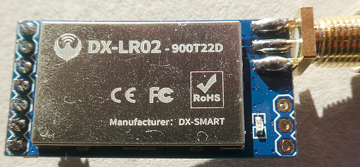
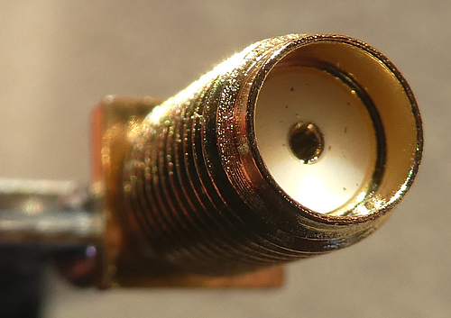
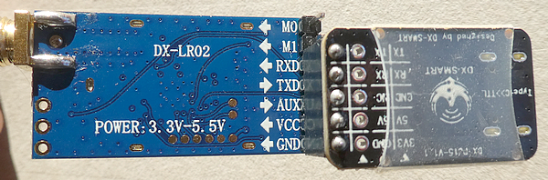

# ESP32 C6 Super Mini connected to an UART interfaced LoRa module

Connecting an UART interfaced LoRa module to an ESP32-C6 Super Mini development board is super easy. With this combination you are being able to receive and transmit LoRa packets and maybe use the ESP32-C6 as gateway to a Zigbee system ?

This is the accompanying repository for my upcoming tutorial "**Connect an UART-interfaced LoRa module with an ESP32-C6 Super Mini device**", which can be found here: <soon>

Additionally, it serves as a collection of materials for my tutorial "**Simple LoRa transmissions over several kilometers using UART/Serial LoRa modules**", published here: https://medium.com/@androidcrypto/simple-lora-transmissions-over-several-kilometers-using-uart-serial-lora-modules-6c5abbf464f2.

## WARNING: never connect the LoRa module with a power supply without an attached antenna or you will destroy your module !

## LoRa module DX-LR02-900T22D profile

The LoRa modules are designed and distributed by the Chinese company [DX-Smart Technology Co., Ltd](https://medium.com/r/?url=https%3A%2F%2Fen.szdx-smart.com%2F). They are part of a series of LoRa modules for various applications. Interestingly, there is no entry for the model **DX-LR02–900T22D** on the website. 



As I'm located in Germany/Europe, I'm using the **863-915 MHz** variant of the module.

The modules contain the **LR02 LoRa module**, which is powered by an **ASR6601 chip**. The maximum transmit power is specified as **+22 dBm**, and the maximum range (with a clear line of sight) can be 5 kilometers. The sensitivity of the LoRa module is a good **-138 dBm**.

This module does not use a tiny IPEX antenna connector but an **SMA connector** in **female** variant, so you need an antenna (of course, matching to your frequency band) with **male** connector.



The module supports three operating modes: transparent transmission, fixed point-to-point transmission, and broadcast transmission. The control is achieved via (text-based) **AT commands**, which are transmitted from a computer to the module via the **UART interface**.

Finally, the module requires an operating voltage of **3.3–5 volts**. I bought the complete two-piece package of LoRa modules, antennas, USB-to-serial adapters, and USB-C cables for around **14 euros**, including shipping costs.

## Important note:

Communication with this module takes place via the UART (serial) interface and not, as is usually the case, via the SPI interface. I have described the associated changes in detail in my tutorial "**[Simple LoRa transmissions over several kilometers using UART/Serial LoRa modules](https://medium.com/@androidcrypto/simple-lora-transmissions-over-several-kilometers-using-uart-serial-lora-modules-6c5abbf464f2)**". Please inform yourself thoroughly before purchasing such a module!

### Connections between the LoRa module and the USB adapter
````plaintext
LoRA module - USB adapter
M0  - not connected
M1  - not connected
RXD - TX pin
TXD - RX pin
AUX - AUS pin
VCC - 5V pin
GND - GND pin
````


### Connections between the LoRa module and the ESP32-C6 Super Mini
````plaintext
LoRA module - ESP32-C6 SM
M0  - not connected
M1  - not connected
RXD - <soon>
TXD - <soon>
AUX - not connected
VCC - 3.3V pin
GND - GND pin
````

## Sketch for the tutorial

The sketh is located in the subfolder "**Esp32_C6_SM_SSD1306_DX_LR02_Monitor**" in this repository.

### Development Environment
````plaintext
Arduino IDE Version 2.3.6 (Windows)
arduino-esp32 boards Version 3.3.5 (https://github.com/espressif/arduino-esp32) that is based on Espressif ESP32 Version 5.5.1
````

For compiling and uploading, please use the **ESP32C6 Dev Module**. Don't forget to enable the setting "**USB CDC on boot enabled**" in "Tools" to see the Serial Monitor prints.

## Support material from the manufacturer

Under the heading Support/Data Download, however, we can download additional material about our LoRa module, depending on your frequency band (868/915 MHz or 433 MHz). 

You can download a support package from a [Google Drive folder](https://drive.google.com/drive/folders/1vnpHof7xpGiuIgEsvuhjO6LymLuNOWeB). I'm recommending downloading the complete folder, and the most important document is in the subfolder 03-Technical Information.

This repository contains the material downloaded in January 2026. Please keep in mind that my material may get outdated, so downloading it from an "official" source is always the best choice.

### Content of folder 03-Technical Information

The most important documenmt in this folder is "**DX-LR02–900T22D Serial port application guide.pdf**", as it gives us the necessary information about the AT-commands.

### Content of folder 04-PC-Tools

The support package includes a Windows program that can be used without installation (**UartAssist.exe** in version 5.0.14) and is working properly. On my macOS, I'm using [**Serial Console Pro**](https://github.com/miroslavpetrov/Serial-Console-Pro) by Miroslav Petrov. The "Releases" section contains ready-to-use, pre-compiled Windows and macOS versions of the terminal program.

Additionally, I uploaded an **updated version of UartAssistant.exe** with version 5.1.5 in the same directory.

As the Windows program is a little bit more user-friendly, I'm using this program for demonstration. 

If you already programmed with ESP32 boards, you have probably installed the **CH34x driver** on your Windows computer before. A suitable driver is available in the support package if you should need one. If you prefer to download a more recent CH34x driver, here is a link to the [manufacturer's website](https://www.wch.cn/downloads/CH341SER_ZIP.html) (please use Google Chrome translator to get an English translation).

